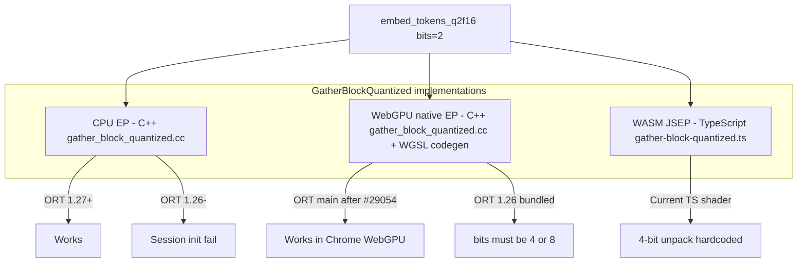

# Running Gemma 4 mobile `q2f16` (2-bit gather) — research notes

Deep-dive on why `onnx-community/gemma-4-E*B-it-qat-mobile-ONNX` models fail today in this lab (and in transformers.js generally), what actually needs 2-bit support, and the concrete paths to make them run.

**Models**

| Repo | Text quants | Intended device (model card) |
|------|-------------|------------------------------|
| [gemma-4-E2B-it-qat-mobile-ONNX](https://huggingface.co/onnx-community/gemma-4-E2B-it-qat-mobile-ONNX) | `q2f16` only | WebGPU + fp16 activations |
| [gemma-4-E4B-it-qat-mobile-ONNX](https://huggingface.co/onnx-community/gemma-4-E4B-it-qat-mobile-ONNX) | `q2f16` only | WebGPU + fp16 activations |

**Bundled ORT in `@huggingface/transformers` 4.2.0 (this repo)**

| Package | Version |
|---------|---------|
| `onnxruntime-node` | 1.24.3 |
| `onnxruntime-web` | 1.26.0-dev.20260416-b7804b056c |

The [E4B QAT mobile Getting Started](https://huggingface.co/onnx-community/gemma-4-E4B-it-qat-mobile-ONNX#getting-started) section (same for E2B) states these checkpoints require **ONNX Runtime 1.27.0+**. Until that release is on npm, build and install from [source](https://onnxruntime.ai/docs/build/).

---

## Official Getting Started (model card)

Source: [gemma-4-E4B-it-qat-mobile-ONNX → Getting Started](https://huggingface.co/onnx-community/gemma-4-E4B-it-qat-mobile-ONNX#getting-started)

The Hub README is the canonical runbook. It uses **Python `onnxruntime` directly** (four separate sessions), not transformers.js. Summary and mapping to this repo:

### Runtime requirement

> You can use these Gemma 4 QAT models with the latest version of ONNX Runtime (**1.27.0 and above**). Until this release is public, you will need to build and install from source.

This matches our finding: bundled transformers.js ORT (1.24.3 / 1.26.0-dev) is **too old** for `GatherBlockQuantized bits=2` in `embed_tokens_q2f16.onnx`.

### Four ONNX sessions (multimodal)

| Session file | Dtype | Role |
|--------------|-------|------|
| `onnx/embed_tokens_q2f16.onnx` | q2f16 | Token → embedding lookup; outputs **`inputs_embeds`** + **`per_layer_inputs`** (PLE) |
| `onnx/decoder_model_merged_q2f16.onnx` | q2f16 | Autoregressive decoder; KV cache via `past_key_values` / `present.*` |
| `onnx/vision_encoder_fp16.onnx` | fp16 | Image → `image_features` (injected at `image_token_id`) |
| `onnx/audio_encoder_q2f16.onnx` | q2f16 | Audio → `audio_features` (injected at `audio_token_id`) |

Download shards with `snapshot_download` and `allow_patterns` per file (each `.onnx` has multi-GB `*.onnx_data` siblings).

### Execution providers (order matters)

```python
providers = ['WebGpuExecutionProvider', 'CPUExecutionProvider']
```

WebGPU is **first** — this is the intended on-device path. CPU is fallback. The model card does **not** document WASM/JSEP.

### Generation loop (high level)

1. **Embed:** `inputs_embeds, per_layer_inputs = embed_session.run(None, {"input_ids": input_ids})`
2. **Multimodal inject (once):** scatter `vision_session` / `audio_session` features into `inputs_embeds` at image/audio token positions.
3. **Decode:** `decoder_session.run` with `inputs_embeds`, `attention_mask`, **`per_layer_inputs`**, `position_ids`, `num_logits_to_keep`, and `past_key_values`.
4. **KV init:** empty cache — `past_key_values` tensors shaped `[batch, heads, 0, head_dim]` (fp16 or fp32 per input type).
5. **Sample:** greedy `argmax` on `logits[:, -1]`; append token; roll `past_key_values` from `present.*` outputs.

`per_layer_inputs` is required — Gemma 4 E2B/E4B use **Per-Layer Embeddings (PLE)**. Text-only transformers.js loads `embed_tokens` + `decoder_model_merged` but the decoder still expects `per_layer_inputs` from the embed session.

### transformers.js equivalent (text-only)

```javascript
import { pipeline } from '@huggingface/transformers';

const gen = await pipeline('text-generation', 'onnx-community/gemma-4-E4B-it-qat-mobile-ONNX', {
  device: 'webgpu',   // matches transformers.js_config.device
  dtype: 'q2f16',     // or per-component map from config.json
});
```

Still blocked today until ORT 1.27+ is wired into transformers.js. This repo probes with `createTextGenerator()` (`lib/transformers-runtime.mjs`) — same ORT version constraint.

### Best practices (from model card)

| Topic | Recommendation |
|-------|----------------|
| Sampling | `temperature=1.0`, `top_p=0.95`, `top_k=64` |
| Thinking | `<|think|>` at start of system prompt to enable; strip thoughts from multi-turn history |
| Modality order | Image **before** text; audio **after** text |
| Image tokens | Budgets: 70, 140, 280, 560, 1120 (higher = more detail, more compute) |
| Audio/video limits | Audio ≤30s; video ≤60s at 1 fps |

---

## Executive summary

| Component | 2-bit op | Blocker in ORT ≤1.26 | Status on ORT `main` (Jun 2026) |
|-----------|----------|----------------------|----------------------------------|
| `embed_tokens_q2f16.onnx` | `GatherBlockQuantized` **bits=2** | **Fails session init** on CPU and WebGPU native EP | CPU + WebGPU native fixed ([#28530](https://github.com/microsoft/onnxruntime/pull/28530), [#29054](https://github.com/microsoft/onnxruntime/pull/29054)) — targets **ORT 1.27** |
| `decoder_model_merged_q2f16.onnx` | `MatMulNBits` **bits=2** (E2B: 41 layers; E4B: 1) | **Loads on CPU** (ORT 1.26 verified) | Already supported; JSEP WGSL shader has `bits===2` branches |
| WASM JSEP `GatherBlockQuantized` | TS/WGSL shader | **4-bit hardcoded** — ignores `bits` attribute | **Not fixed** by native WebGPU PRs; needs separate JSEP shader work |

**Bottom line:** the immediate failure is the **embedding lookup**, not the decoder. Upgrading to ORT **1.27+** unblocks CPU and browser **WebGPU native** paths. **WASM JSEP** (Node `wasm-jsep` backend) still needs a JSEP shader update even after the native WebGPU fix.

---

## Model graph anatomy

### `embed_tokens_q2f16.onnx` — where 2-bit gather lives

Inspected graphs:

| Model | `GatherBlockQuantized` | `bits` values | Outputs |
|-------|------------------------|---------------|---------|
| **E2B** | 2 nodes | 2 (main vocab) + **4** (PLE table) | `inputs_embeds`, `per_layer_inputs` |
| **E4B** | 2 nodes | **2** + **2** (both tables 2-bit) | `inputs_embeds`, `per_layer_inputs` |

Shared layout: `gather_axis=0`, `quantize_axis=1`, `block_size=256`; weight `uint8`, scales `float16`. The model card’s embed step returns **both** outputs — the decoder requires `per_layer_inputs` for PLE.

Packing for `bits=2` on `uint8` data: **4 values per byte**, low-order bits first (per [ContribOperators](https://github.com/microsoft/onnxruntime/blob/main/docs/ContribOperators.md#commicrosoftgatherblockquantized)). Default zero point when omitted: `2^(bits-1)` → **2** for 2-bit.

### `decoder_model_merged_q2f16.onnx` — MatMul, not Gather

| Model | `MatMulNBits` count | `bits` distribution |
|-------|---------------------|---------------------|
| **E2B** | 241 | 2-bit: **41**, 4-bit: 130, 8-bit: 70 |
| **E4B** | 301 | 2-bit: **1**, 4-bit: 216, 8-bit: 84 |

No `GatherBlockQuantized` nodes in either decoder. E4B mobile schema uses 2-bit matmul in far fewer layers than E2B (1 vs 41), but **both** models still fail at load because `embed_tokens` runs first.

Sample E2B 2-bit node: `block_size=32`, `K=1536`, `N=24576`, no zero-point input (default `zp = 2`).

**Implication:** once `embed_tokens` loads, the decoder is much closer to working on current ORT CPU. The Eloquent issue ([#28895](https://github.com/microsoft/onnxruntime/issues/28895)) mentions “same error on the decoder”, but in our ONNX export the decoder does **not** contain `GatherBlockQuantized`; the failure happens when loading `embed_tokens` first.

### `transformers.js_config` (from `config.json`)

```json
{
  "device": "webgpu",
  "dtype": {
    "decoder_model_merged": "q2f16",
    "embed_tokens": "q2f16",
    "audio_encoder": "q2f16",
    "vision_encoder": "fp16"
  },
  "use_external_data_format": {
    "decoder_model_merged_q2f16.onnx": 1,
    "embed_tokens_q2f16.onnx": 1,
    "audio_encoder_q2f16.onnx": 1,
    "vision_encoder_fp16.onnx": 1
  }
}
```

Google’s mobile schema (**wNa8o8**) targets 2-bit decoder layers + optimized KV; the ONNX export maps that to `MatMulNBits` + `GatherBlockQuantized` for embeddings.

---

## The `GatherBlockQuantized` operator

Custom Microsoft contrib op (`com.microsoft.GatherBlockQuantized`). Block-wise quantized **Gather**: lookup token indices in a packed weight table, then dequantize with per-block scales (and optional zero points).

**Attributes (relevant to q2f16)**

| Attribute | Mobile embed value | Meaning |
|-----------|-------------------|---------|
| `bits` | 2 (main), 4 (PLE) | Quantization width; uint8 supports 2, 4, 8 |
| `block_size` | 256 | Power of 2, ≥ 16 |
| `gather_axis` | 0 | Vocab row index |
| `quantize_axis` | 1 | Last dim for uint8 packing |

**Inputs:** `data` (packed uint8), `indices` (int64), `scales` (fp16), optional `zero_points`.

**Current error (ORT ≤1.26, CPU)**

```
bits_ == 4 || bits_ == 8 was false.
GatherBlockQuantized only support bits==4 or 8
```

Source: `onnxruntime/contrib_ops/cpu/quantization/gather_block_quantized.cc` line 56 in shipped builds.

---

## Three separate ORT code paths (do not conflate)

`GatherBlockQuantized` is implemented **three different ways**. Fixing one does not fix the others.



### 1. CPU EP (`onnxruntime-node`)

- **ORT ≤1.26:** rejects `bits=2` at kernel registration.
- **ORT `main` / 1.27:** [#28530](https://github.com/microsoft/onnxruntime/pull/28530) merged 2026-05-26 — `Get2BitElementUint8`, default zp `2^(bits-1)`, uint8-only 2-bit path.
- **Verified locally:** ORT **1.26.0** CPU still fails on `embed_tokens_q2f16`; **decoder loads in ~1.9s**.

### 2. WebGPU native EP (`onnxruntime-web/webgpu`, browser Chrome)

- C++ op in `onnxruntime/contrib_ops/webgpu/quantization/`.
- **ORT ≤1.26:** `bits_ == 4 || bits_ == 8` enforce in header — same user-visible error as [#28895](https://github.com/microsoft/onnxruntime/issues/28895).
- **ORT `main`:** [#28530](https://github.com/microsoft/onnxruntime/pull/28530) (uint8 2-bit packing) + [#29054](https://github.com/microsoft/onnxruntime/pull/29054) merged 2026-06-15 (sign-extension for signed 2-bit values and zero points).
- **Requirements for `q2f16`:** discrete GPU WebGPU adapter with **`shader-f16`** (activations and scales are fp16). Software adapters (SwiftShader, lavapipe) often lack f16 shaders — use `q4` for probes on headless VMs.

### 3. WASM JSEP WebGPU shaders (`ort-wasm-simd-threaded.jsep.*`)

Used by this repo’s Node `wasm-jsep` backend (`lib/transformers-runtime.mjs` → `bootstrapOrt({ wasmVariant: 'jsep' })`).

`onnxruntime-web/lib/wasm/jsep/webgpu/ops/gather-block-quantized.ts`:

- Does **not** parse or pass the `bits` ONNX attribute.
- WGSL hardcodes **4-bit** unpacking (`packed_4bit_quantized_data`, nibble shifts, `0x0f0f0f0f` mask).
- **ORT 1.27 dev npm (20260506)** — file unchanged; still 4-bit only.

**Contrast:** `matmulnbits.ts` in the same JSEP tree **does** handle `bits===2` (masks `0x3`, default zp `2.0`). Decoder 2-bit matmul on JSEP is ahead of gather.

---

## Local benchmark evidence (this VM)

From `GEMMA4_LEADERBOARD.md` / `results/benchmark-gemma4-*.json`:

| Model | Quant | Backend | Result |
|-------|-------|---------|--------|
| E2B-qat-mobile | q2f16 | cpu | **error** (`gather_quant`) |
| E4B-qat-mobile | q2f16 | cpu | **error** (`gather_quant`) |
| E2B-it | q4 / q4f16 | cpu | ok |
| E2B-it | q4 / q4f16 | wasm-jsep | load ok, infer OOM |

Fresh verification (ORT 1.26.0, `/tmp` install):

| Session | CPU load |
|---------|----------|
| `embed_tokens_q2f16.onnx` | **FAIL** — `bits==4 or 8` |
| `decoder_model_merged_q2f16.onnx` | **OK** — 35 inputs, ~1.9s |

---

## How to run `q2f16` (actionable paths)

### Path A — Browser WebGPU (intended deployment)

**Matches the model card:** `providers = ['WebGpuExecutionProvider', 'CPUExecutionProvider']` and `transformers.js_config.device: "webgpu"`.

1. Use **ONNX Runtime ≥ 1.27** (release or build from `main` after 2026-06-15).
2. Bump `onnxruntime-web` in transformers.js (or override locally).
3. Load with `device: 'webgpu'`, `dtype: 'q2f16'` (or per-component map from `transformers.js_config`).
4. Chrome/Edge **121+** on Windows/Mac with a GPU that exposes `shader-f16`.
5. Mount external data shards (multi-GB `*.onnx_data`).

```javascript
import { pipeline } from '@huggingface/transformers';

const gen = await pipeline('text-generation', 'onnx-community/gemma-4-E4B-it-qat-mobile-ONNX', {
  device: 'webgpu',
  dtype: 'q2f16',
});
```

For the full multimodal flow (vision + audio + manual KV loop), follow the [E4B Getting Started](https://huggingface.co/onnx-community/gemma-4-E4B-it-qat-mobile-ONNX#getting-started) Python example.

**Track:** [ORT #28895](https://github.com/microsoft/onnxruntime/issues/28895) (filed for Eloquent / transformers.js), fixed by [#29054](https://github.com/microsoft/onnxruntime/pull/29054) on `main`.

### Path B — CPU (Node / server)

1. **ORT 1.27+** `onnxruntime-node` with CPU EP.
2. `device: 'cpu'`, `dtype: 'q2f16'`.
3. Expect high RAM (~2–5 GB+ for E2B text-only); much slower than WebGPU but useful for correctness testing.
4. Optional: `session_options: { mlas.use_lut_gemm: '1' }` for faster **MatMulNBits** 2-bit layers (AVX2, shape constraints) — does not affect Gather.

**Note:** ORT 1.27.0-dev npm **node** packages failed install here (missing nightly NuGet); build from [source](https://onnxruntime.ai/docs/build/) or wait for stable 1.27.

### Path C — Node WASM JSEP (this repo’s `wasm-jsep`)

**Not ready for q2f16 embeddings** even after native WebGPU 2-bit merge:

1. Gather JSEP shader must gain `bits` uniform and 2-bit (and 8-bit) unpack branches, mirroring CPU `Get2BitElementUint8`.
2. `parseGatherBlockQuantizedAttributes` must forward `bits` from ONNX.
3. Until then, JSEP may appear to “run” 4-bit gather graphs but will silently mis-dequantize 2-bit weights.

### Path D — Build ORT from source (optional)

**Default:** use **npm ORT 1.27.0** — [docs/ort-127-install.md](./ort-127-install.md). No build required for q2f16 or E2B q4 speedups.

**Optional local build** for unreleased ORT `main`: `npm run build:ort` clones `microsoft/onnxruntime` to `vendor/onnxruntime`, builds Release + nodejs with `CC=gcc CXX=g++`. `npm run build:ort:web` builds WASM variants + JS bundles.

```bash
# Optional (~15–90 min); only if you need ORT newer than npm 1.27
npm run build:ort          # onnxruntime-node
npm run build:ort:web      # onnxruntime-web (requires vendor source)
# or: npm run build:ort:all

# Wire file: deps in package.json, then:
ONNXRUNTIME_NODE_INSTALL=skip npm install

# Smoke tests
npm run verify:ort:q2f16       # CPU: embed_tokens_q2f16
npm run verify:ort:web:q2f16   # WASM JSEP: embed_tokens_q2f16 (needs .onnx_data shard)

# Full text-gen on mobile q2f16 (CPU)
node --expose-gc scripts/benchmark-gemma4-variant.mjs \
  --model-id onnx-community/gemma-4-E2B-it-qat-mobile-ONNX \
  --model-slug E2B-qat-mobile --dtype q2f16 --backend cpu --max-prompts 1
```

**Verified on this VM (ORT 1.27.0 npm / 1.28.0 local build):**

| Check | Result |
|-------|--------|
| `embed_tokens_q2f16` session create (CPU) | **OK** (was FAIL on ORT 1.24–1.26) |
| `embed_tokens_q2f16` session create (wasm-jsep) | **OK** (with external data mount) |
| E2B-qat-mobile `q2f16` cpu text-gen | **OK** — load 3.8s, ~12.8s/prompt, 1.25 tok/s, RSS ~1.7 GB |
| E2B-qat-mobile `q2f16` wasm-jsep full infer | **OOM** on this VM (~7 GB RSS); load OK |

`vendor/onnxruntime/` is gitignored; only `scripts/build-ort.sh`, `scripts/build-ort-web.sh`, and `package.json` overrides are committed.

**Web build notes:** emsdk is installed from ORT's submodule on first run. A stub `package.json` with `"type":"commonjs"` is written under `vendor/onnxruntime/` so ORT's `wasm_post_build.js` works when the parent repo is ESM. JSPI wasm files are stubbed from asyncify artifacts (transformers.js uses jsep/asyncify, not jspi).

**Compiler note:** default `c++` on this image was **clang** without `-lstdc++`; the build script forces `gcc`/`g++`.

### Path E — Build ORT from `main` manually

For early adopters or custom EP flags (WebGPU, CUDA):

```bash
# See https://onnxruntime.ai/docs/build/
./build.sh --config Release --build_shared_lib --parallel \
  --use_webgpu --cmake_extra_defines onnxruntime_BUILD_UNIT_TESTS=OFF
```

Wire the built `onnxruntime-node` / `onnxruntime-web` into transformers.js via `npm link` or `package.json` overrides.

### Path F — Use a different artifact (no 2-bit gather)

| Format | Where | Notes |
|--------|-------|-------|
| Standard ONNX `q4f16` | [gemma-4-E2B-it-ONNX](https://huggingface.co/onnx-community/gemma-4-E2B-it-ONNX) | Works today on CPU; WebGPU needs `shader-f16` |
| GGUF Q4_0 | Google QAT collection | llama.cpp / local GGUF runners |
| Compressed Tensors w4a16 | vLLM | Server-side, not browser |
| Mobile wNa8o8 (non-ONNX) | Google | Custom mobile schema, not this Hub export |

---

## Upgrade checklist for this repo

**Default:** ORT **1.27.0** from npm — see **[ort-127-install.md](./ort-127-install.md)**. `package.json` pins `onnxruntime-{common,node,web}@1.27.0` with overrides for `@huggingface/transformers`.

When a newer ORT ships on npm:

1. Bump version in `dependencies` and `overrides`.
2. `npm install` and re-run verification below.

**With npm ORT 1.27:**

```bash
npm run verify:ort:q2f16
npm run verify:ort:web:q2f16
npm run probe:gemma4:quick   # add --model E2B-qat-mobile --dtype q2f16 --backend cpu,wasm-jsep
npm run benchmark:gemma4:quick  # extend matrix for q2f16 when ready
```

**Optional session options (decoder MatMulNBits 2-bit on CPU)**

```javascript
session_options: {
  // Faster 2-bit matmul when shapes + AVX2 allow (see ORT #26695)
  'mlas.use_lut_gemm': '1',
}
```

---

## Upstream timeline

| Date | Change |
|------|--------|
| 2025+ | [#25582](https://github.com/microsoft/onnxruntime/commit/d5d3b287b1ad271aeb3f728640f3ed2ddee21357) — CPU `MatMulNBits` 2-bit fallback dequant |
| 2026-05-26 | [#28530](https://github.com/microsoft/onnxruntime/pull/28530) — CPU + WebGPU native `GatherBlockQuantized` uint8 2-bit |
| 2026-06-08 | [#28895](https://github.com/microsoft/onnxruntime/issues/28895) — Eloquent / Gemma mobile ONNX blocked on WebGPU gather |
| 2026-06-15 | [#29054](https://github.com/microsoft/onnxruntime/pull/29054) — WebGPU native sign-extension for 2-bit gather |
| TBD | **ORT 1.27.0** stable npm — model card requirement |
| TBD | JSEP `gather-block-quantized.ts` 2-bit — **no PR identified yet** |

---

## References

- [Gemma 4 E4B QAT mobile ONNX — Getting Started](https://huggingface.co/onnx-community/gemma-4-E4B-it-qat-mobile-ONNX#getting-started) — canonical ORT 1.27+ runbook (4 sessions, WebGPU-first)
- [Gemma 4 E2B QAT mobile ONNX](https://huggingface.co/onnx-community/gemma-4-E2B-it-qat-mobile-ONNX) — same layout, smaller variant
- [GatherBlockQuantized contrib op docs](https://github.com/microsoft/onnxruntime/blob/main/docs/ContribOperators.md#commicrosoftgatherblockquantized)
- [ORT #28895 — WebGPU 2-bit gather](https://github.com/microsoft/onnxruntime/issues/28895)
- [ORT #28530 — CPU/WebGPU 2-bit gather](https://github.com/microsoft/onnxruntime/pull/28530)
- [ORT #29054 — WebGPU sign-extension fix](https://github.com/microsoft/onnxruntime/pull/29054)
- [Google Gemma 4 QAT collection](https://huggingface.co/collections/unsloth/gemma-4-qat)
- This repo: `config/gemma4-models.mjs`, `lib/transformers-runtime.mjs`, `GEMMA4_LEADERBOARD.md`
